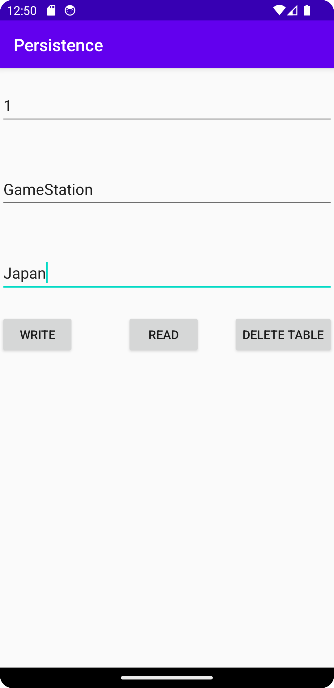
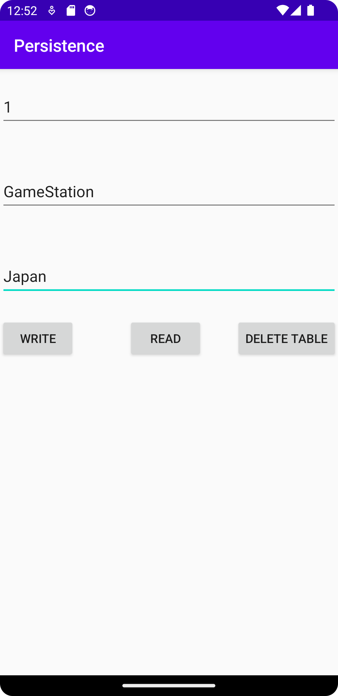

# Rapport

**Write, Read and delete data for the database**

```
...
// Grab data from editTexts and add these data to the database
writeButton.setOnClickListener(new View.OnClickListener() {
    @Override
    public void onClick(View view) {

        // take all data from editText and store all the data on contractor
        data = new Data(etID.getText().toString(), etName.getText().toString(), etLocation.getText().toString());

        // return if insertData successful or not
        boolean success = databaseHelper.AddData(data);

        // checking if success for adding a data
        if (success)
        {
            Toast.makeText(MainActivity.this, "Success for adding a data!", Toast.LENGTH_SHORT).show();
        }
        else
        {
            String message = "Failed for adding a data, because primary key ID: " + data.getID() + " has already applied?";
            Toast.makeText(MainActivity.this, message, Toast.LENGTH_SHORT).show();
        }
    }
});
...
```
När "writeButton" har klickats kommer den att hämta data från editTexts (om det finns värden i editTexts) 
och lagra dessa data i ett data. Därefter används metoden "AddData()" från "databaseHelper" 
för att lägga till all data i databasen och returnera sant eller falskt beroende på beränka resultat. 
Det finns en if-sats som kollar om insättningen var lyckad eller inte och visar ett lämpligt meddelande.

```
...
readButton.setOnClickListener(new View.OnClickListener() {
    @Override
    public void onClick(View view) {

        // select all data from database and grab these to store i a variable
        List<Data> all = databaseHelper.SelectAllData();

        // if data is empty then print massage "Read data is empty" otherwise "Read data was successful!"
        if(all.isEmpty())
        {
            Toast.makeText(MainActivity.this, "Read data is empty", Toast.LENGTH_SHORT).show();
        }
        else
        {
            Toast.makeText(MainActivity.this, "Read data was successful!", Toast.LENGTH_SHORT).show();
        }

        StringBuilder stringBuilder = new StringBuilder();

        // print each data item in a new line
        for (int i = 0; i < all.size(); i++) {
            stringBuilder.append(all.get(i)).append("\n");
        }

        // print all data items on textView
        tvData.setText(stringBuilder.toString());
    }
});
...
```
När "readButton" klickas på kommer alla data hämtas från databasen och lagra i en variabel.
Därefter kollar om datan är tom. Om den är tom, kommer skriva ut en meddelande "Read data is empty" annars skrivs "Read data was successful!" ut.
Sedan läsa hela data från databasen och skrivs varje dataobjekt ut på en ny rad i en textview.

```
...
deleteButton.setOnClickListener(new View.OnClickListener() {
    @Override
    public void onClick(View view) {

        // return true if data is deleted
        boolean deleteSuccess = databaseHelper.DropTable();

        // if delete data was successful then print "Table is deleted" otherwise "Cannot delete table, because there is no table"
        if (deleteSuccess)
        {
            Toast.makeText(MainActivity.this, "Table is deleted", Toast.LENGTH_SHORT).show();
        }
        else
        {
            Toast.makeText(MainActivity.this, "Cannot delete table, because there is no table", Toast.LENGTH_SHORT).show();
        }
    }
});
...
```
När "deleteButton" klickas på returneras true om datan har raderats. 
Om denna lyckades, skrivs ut meddelande "Table is deleted" annars skrivs "Cannot delete table, because there is no table" ut.
Detta gör att om använderen vill rensa databasen kan de använda delete-funktionen för att ta bort hela tabellen och all data.


Där användaren kan skriva in ID, namn och plats. När användaren klickar på "write"-knappen får de ett meddelnade om att datan har lyckats.
Om datan inte lyckas läggs till kan hända att ID redan används. I så fall behöver användren välja ett annat ID-nummer.


Där användaren måste klicka på "write"-knappen för att lägga till data. Sedan behöver det att användaren klickar på "read"-knappen för att visa datan på views.
Om användaren försöker klicka på "read"-knappen utan att först klicka på "write"-knappen visas ett meddelande om att datan är tom.


Det finns en "Delete Table"-knapp för att ta bort all data. När användaren klickar på knappen visas ett meddelande "Table is deleted".
Om den inte lyckas kan hända att tabellens data redan har rederat eller att det inte finns någon data från början.
Observera att data fortfarende kan synas på views tills användaren klickar på "read"-knappen för att uppdatera views.

Läs gärna:

- Boulos, M.N.K., Warren, J., Gong, J. & Yue, P. (2010) Web GIS in practice VIII: HTML5 and the canvas element for interactive online mapping. International journal of health geographics 9, 14. Shin, Y. &
- Wunsche, B.C. (2013) A smartphone-based golf simulation exercise game for supporting arthritis patients. 2013 28th International Conference of Image and Vision Computing New Zealand (IVCNZ), IEEE, pp. 459–464.
- Wohlin, C., Runeson, P., Höst, M., Ohlsson, M.C., Regnell, B., Wesslén, A. (2012) Experimentation in Software Engineering, Berlin, Heidelberg: Springer Berlin Heidelberg.